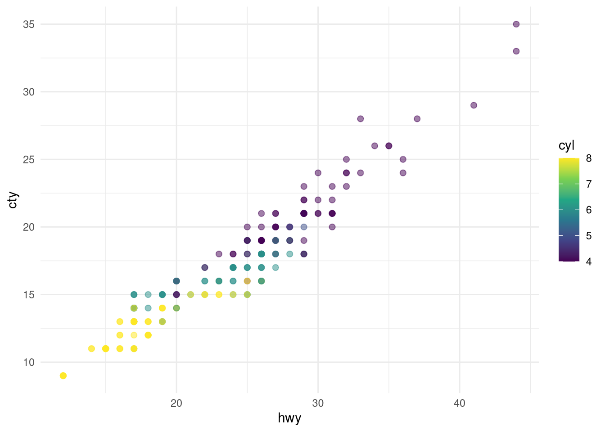

::: {.cell}

:::


There are 234 observations in our data.


::: {.cell}

:::


The average city mileage of the cars in our data is 16.86 and the average highway mileage is 23.44.

The plots in @fig-mpg show the relationship between city and highway mileage for 38 popular models of cars.
In @fig-mpg-1 the points are colored by the number of cylinders while in @fig-mpg-2 the points are colored by engine displacement.


::: {#fig-mpg .cell .column-page layout-ncol="2"}

```{.r .cell-code}
ggplot(mpg, aes(x = hwy, y = cty, color = cyl)) +
  geom_point(alpha = 0.5, size = 2) +
  scale_color_viridis_c() +
  theme_minimal()

ggplot(mpg, aes(x = hwy, y = cty, color = displ)) +
  geom_point(alpha = 0.5, size = 2) +
  scale_color_viridis_c(option = "E") +
  theme_minimal()
```

::: {.cell-output-display}
{#fig-mpg-1 width=672}
:::

::: {.cell-output-display}
{#fig-mpg-2 width=672}
:::

City and highway mileage for 38 popular models of cars.
:::
