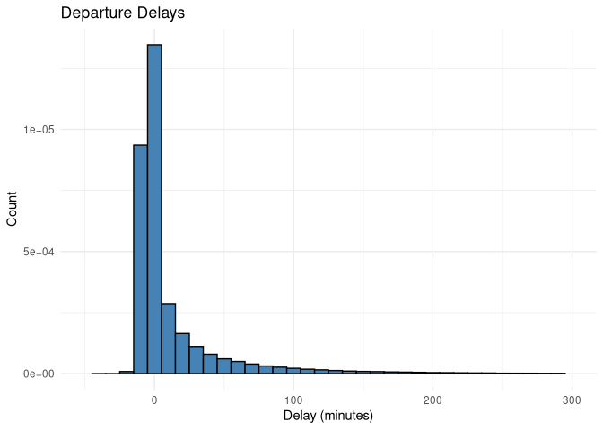
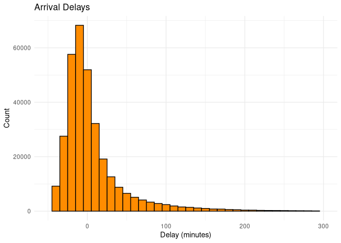
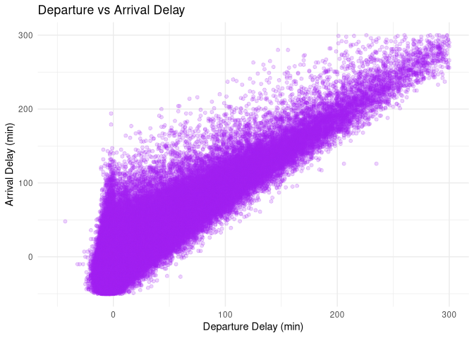

# NYC Flights 2013 Analysis


# Variable 1: Departure Delay

``` r
ggplot(nycflights13::flights, aes(x = dep_delay)) +
  geom_histogram(binwidth = 10, fill = "steelblue", color = "black") +
  xlim(-50, 300) +
  labs(title = "Departure Delays", x = "Delay (minutes)", y = "Count") +
  theme_minimal()
```

    Warning: Removed 8865 rows containing non-finite outside the scale range
    (`stat_bin()`).

    Warning: Removed 2 rows containing missing values or values outside the scale range
    (`geom_bar()`).

<figure>

<figcaption aria-hidden="true">Distribution of Departure
Delays</figcaption>
</figure>

# Variable 2: Arrival Delay

``` r
ggplot(nycflights13::flights, aes(x = arr_delay)) +
  geom_histogram(binwidth = 10, fill = "darkorange", color = "black") +
  xlim(-50, 300) +
  labs(title = "Arrival Delays", x = "Delay (minutes)", y = "Count") +
  theme_minimal()
```

    Warning: Removed 11152 rows containing non-finite outside the scale range
    (`stat_bin()`).

    Warning: Removed 2 rows containing missing values or values outside the scale range
    (`geom_bar()`).

<figure>

<figcaption aria-hidden="true">Distribution of Arrival
Delays</figcaption>
</figure>

# Relationship Between Departure and Arrival Delays

``` r
ggplot(nycflights13::flights, aes(x = dep_delay, y = arr_delay)) +
  geom_point(alpha = 0.2, color = "purple") +
  xlim(-50, 300) + ylim(-50, 300) +
  labs(title = "Departure vs Arrival Delay", x = "Departure Delay (min)", y = "Arrival Delay (min)") +
  theme_minimal()
```

    Warning: Removed 11260 rows containing missing values or values outside the scale range
    (`geom_point()`).

<figure>

<figcaption aria-hidden="true">Relationship Between Departure and
Arrival Delays</figcaption>
</figure>

# Summary & Insights

In this analysis, I explored how departure delays relate to arrival
delays for flights leaving NYC in 2013. First, I visualized the
distribution of each variable separately. Both `dep_delay` and
`arr_delay` are heavily skewed right, with most flights having small
delays or even early arrivals. A smaller number of flights experienced
long delays, which are clearly visible in the histogram tails.

In the scatter plot of departure delay vs arrival delay, we see a clear
positive relationship. This means flights that depart late often arrive
late as well—though not perfectly. The variation shows that some flights
may make up lost time, while others may face additional delays. I chose
histograms for univariate plots because they clearly show skewness and
density, and a scatter plot for the bivariate relationship to visualize
spread and correlation between the two variables.
