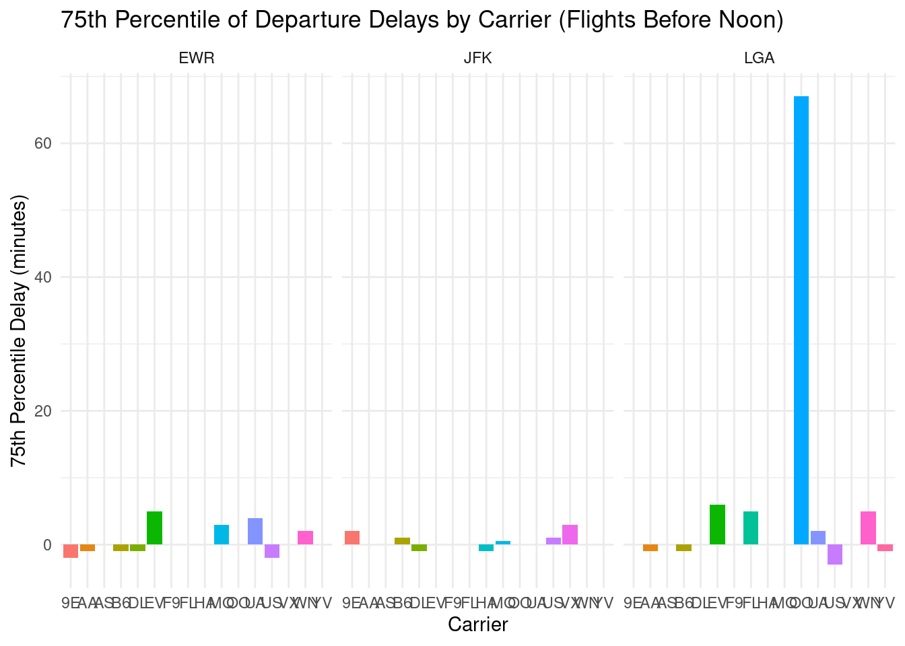
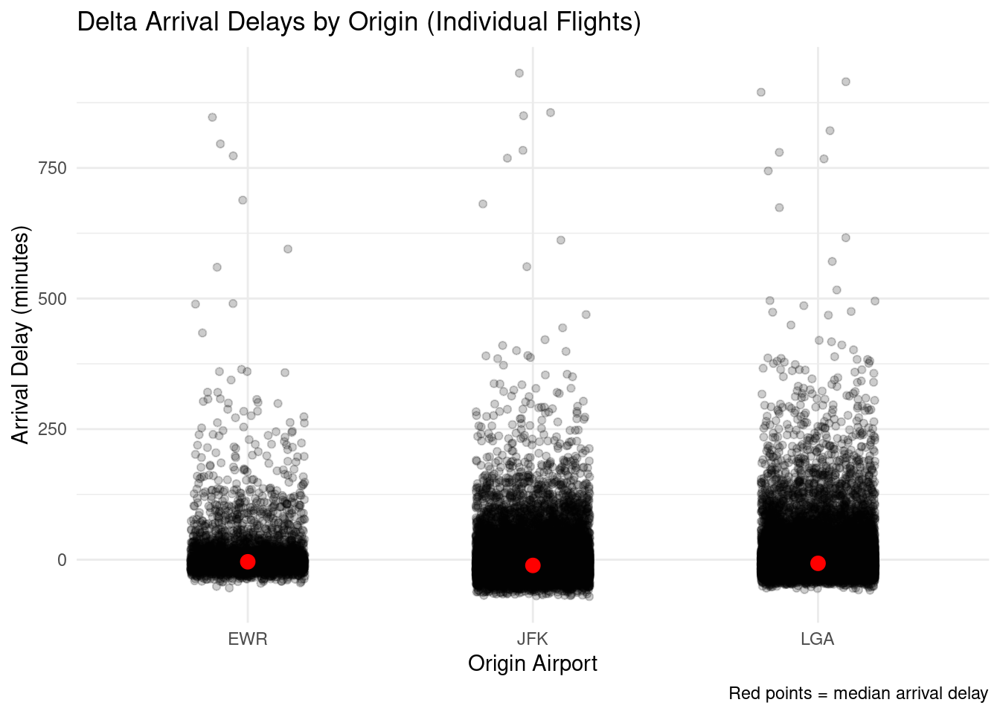

## 1. 75th Percentile of Departure Delays by Airline (Flights Before Noon)

We compute the 75th percentile of departure delays for flights scheduled to depart before noon, grouped by origin airport and carrier.


::: {.cell}

```{.r .cell-code}
# Calculate 75th percentile of departure delays for flights before noon
dep75 <- flights %>%
  filter(!is.na(dep_delay), hour < 12) %>%
  group_by(origin, carrier) %>%
  summarise(p75 = quantile(dep_delay, 0.75), .groups = "drop")

# Identify carrier with lowest 75th percentile per origin
best_carriers <- dep75 %>%
  group_by(origin) %>%
  slice_min(p75, with_ties = FALSE)

best_carriers
```

::: {.cell-output .cell-output-stdout}

```
# A tibble: 3 × 3
# Groups:   origin [3]
  origin carrier   p75
  <chr>  <chr>   <dbl>
1 EWR    9E         -2
2 JFK    DL         -1
3 LGA    US         -3
```


:::
:::

::: {.cell}

```{.r .cell-code}
# Bar chart of 75th percentile by carrier for each origin
ggplot(dep75, aes(x = carrier, y = p75, fill = carrier)) +
  geom_col(show.legend = FALSE) +
  facet_wrap(~ origin) +
  labs(
    title = "75th Percentile of Departure Delays by Carrier (Flights Before Noon)",
    x = "Carrier",
    y = "75th Percentile Delay (minutes)"
  ) +
  theme_minimal()
```

::: {.cell-output-display}
{width=672}
:::
:::


**Answer:**

- **JFK:** Carrier with lowest 75th percentile of departure delay is **-1** minutes (carrier **DL**).
- **EWR:** Carrier with lowest 75th percentile is **-2** minutes (carrier **9E**).
- **LGA:** Carrier with lowest 75th percentile is **-3** minutes (carrier **US**).


## 2. Best Origin to Minimize Late Arrivals with Delta Airlines

We examine arrival delays for Delta Air Lines (`DL`) and show individual flight delays by origin airport, plus the median delay.


::: {.cell}

```{.r .cell-code}
# Filter Delta flights and remove missing arrival delays
delta <- flights %>%
  filter(carrier == "DL", !is.na(arr_delay))

# Jitter plot showing individual arrival delays
ggplot(delta, aes(x = origin, y = arr_delay)) +
  geom_jitter(alpha = 0.2, width = 0.2) +
  stat_summary(fun = median, geom = "point", size = 3, color = "red") +
  labs(
    title = "Delta Arrival Delays by Origin (Individual Flights)",
    x = "Origin Airport",
    y = "Arrival Delay (minutes)",
    caption = "Red points = median arrival delay"
  ) +
  theme_minimal()
```

::: {.cell-output-display}
{width=672}
:::
:::


**Answer:**

From the distribution of individual arrival delays and the median (red points), the origin airport with the lowest median arrival delay for Delta is **JFK**, making it the best origin to minimize late arrivals when flying Delta.


<!-- Note: You can address the third question (worst destination airport for arrival delays) similarly in another section if needed. -->
