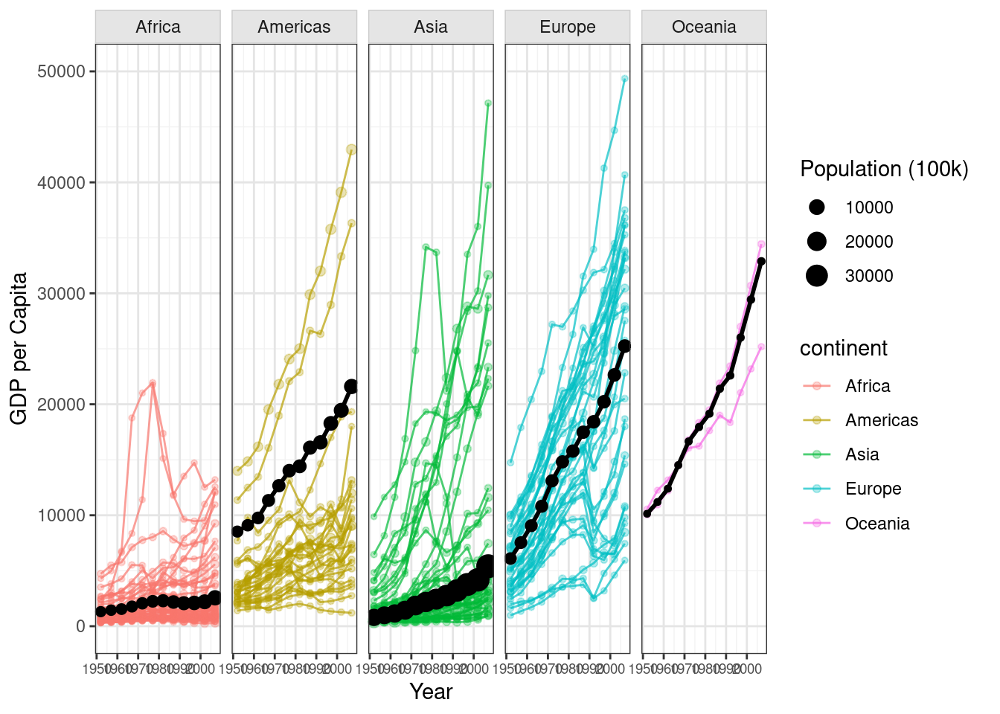

::: {.cell}

```{.r .cell-code}
library(gapminder)
library(tidyverse)


gapminder_filtered <- gapminder %>% 
  filter(country != "Kuwait")

continent_avg <- gapminder_filtered %>%
  group_by(continent, year) %>%
  summarise(
    gdpPercap = weighted.mean(gdpPercap, pop),
    pop = sum(pop)
  )

ggplot() +
  geom_line(data = gapminder_filtered, 
            aes(x = year, y = gdpPercap, group = country, color = continent),
            size = 0.5, alpha = 0.7) +
  
  geom_point(data = gapminder_filtered,
             aes(x = year, y = gdpPercap, size = pop/100000, color = continent),
             alpha = 0.3) +
  
  geom_line(data = continent_avg,
            aes(x = year, y = gdpPercap, group = continent),
            color = "black", size = 1) +
    geom_point(data = continent_avg,
             aes(x = year, y = gdpPercap, size = pop/100000),
             color = "black") +
  
  facet_wrap(~ continent, ncol = 5) +
  
  scale_size_continuous(name = "Population (100k)", range = c(1, 5), 
                        breaks = c(10000, 20000, 30000)) +
  scale_color_manual(name = "continent",
                    values = c("Africa" = "#F8766D", 
                               "Americas" = "#B79F00", 
                               "Asia" = "#00BA38", 
                               "Europe" = "#00BFC4", 
                               "Oceania" = "#F564E3")) +
  
  scale_y_continuous(limits = c(0, 50000)) +
  
  scale_x_continuous(breaks = seq(1950, 2010, by = 10)) +
  
  labs(
    x = "Year",
    y = "GDP per Capita"
  ) +
  
  theme_bw() +
  theme(
    legend.position = "right",
    panel.grid.minor = element_line(color = "gray95"),
    panel.grid.major = element_line(color = "gray90"),
    strip.background = element_rect(fill = "gray90", color = "gray80"),
    strip.text = element_text(face = "plain"),
    axis.text.x = element_text(angle = 0, size = 7),
    plot.margin = margin(5, 10, 5, 5)
  )
```

::: {.cell-output-display}
{width=672}
:::
:::